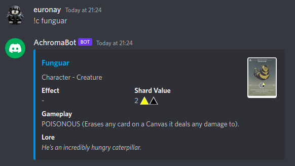

# AchromaBot
Discord bot to search for [Achroma](https://www.achroma.cards/) cards.

## Usage 

Add the Bot to your server using [this link](https://discord.com/api/oauth2/authorize?client_id=1024648820119838771&permissions=0&scope=bot)

Then when any user types `!c` followed by a card name, the card details will be displayed.



## Development

### Running locally

Put the Discord Bot Token in `appsettings.json` and run:
```
dotnet run --project src/AchromaBot.Bot/AchromaBot.Bot.csproj 
```

### Running in Docker 

Build the docker image by running the following in the repository root.
```
docker build -t euronay/achromabot .
```

Run the container with the following command, passing in the Discord Bot Token:
```
docker run --name achromabot -e APP:TOKEN='<token goes here>' -d euronay/achromabot
```